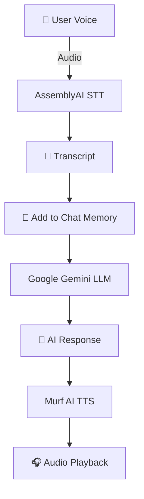

# 🎙️ AI Voice Agent

An AI-powered conversational assistant that listens, understands, and responds in real time — using **Murf AI**, **Google Gemini**, and **AssemblyAI**.

This project was built as part of the **#30DaysofVoiceAgents** challenge by Murf AI.

---

## 🚀 Features
- 🎤 **Voice Input** – Record speech directly from the browser.
- 📝 **Speech-to-Text** – Uses **AssemblyAI** for transcription.
- 🤖 **AI Responses** – Powered by **Google Gemini API**.
- 💬 **Chat Memory** – Keeps conversation history for context.
- 🔊 **Text-to-Speech** – Uses **Murf AI** to generate realistic voice.
- 🧹 **Clear Chat** – Reset conversation anytime.
- ⚠️ **Error Handling** – Fallback voice/text if APIs fail.
- 🎨 **Revamped UI** – Single toggle button, clean layout.

---

## 🛠️ Tech Stack
- **Backend:** FastAPI (Python)
- **Frontend:** HTML, CSS, JavaScript
- **APIs:**
  - [AssemblyAI](https://www.assemblyai.com/) – Speech-to-Text
  - [Google Gemini](https://ai.google/) – AI responses
  - [Murf AI](https://murf.ai/) – Text-to-Speech

---

## 🏗️ Architecture

---
## Project Structure
```mermaid
.
├── main.py               # FastAPI backend
├── static/
│   ├── style.css         # UI styles
│   ├── script.js         # Frontend logic
├── templates/
│   └── index.html        # Web UI
├── .env                  # API keys & config
└── README.md             # Project documentation
```
---
⚙️ Setup Instructions

1️⃣ Install Python Packages
```
pip install fastapi uvicorn python-dotenv requests
```

2️⃣ Add Environment Variables

Create a .env file in the root folder:

```
MURF_API_KEY=your_murf_api_key
MURF_VOICE_ID=your_murf_voice_id
GEMINI_API_KEY=your_gemini_api_key
ASSEMBLYAI_API_KEY=your_assemblyai_api_key
```

3️⃣ Run the Server
```
uvicorn main:app --reload
```
---

⚙️ How It Works
```
1. User clicks record
   Browser starts capturing microphone input.

2. Send audio to backend
   Audio is sent to FastAPI backend via /agent/chat/{session_id} endpoint.

3. Speech-to-Text
   Backend sends audio to AssemblyAI for transcription.

4. Contextual AI response
   Transcript + chat history sent to Google Gemini for generating a response.

5. Text-to-Speech
   Response text sent to Murf AI for natural voice output.

6. Play audio
   The browser automatically plays the generated audio.

7. Maintain chat memory
   Session-based memory stores past messages for context.

8. Error Handling
   If any API fails, a fallback voice/text response is sent.
```
---
📦 Dependencies

Install using pip:
```
pip install fastapi uvicorn python-dotenv requests
```

Libraries used:
```
fastapi – API server

uvicorn – ASGI server to run FastAPI

python-dotenv – Load .env variables

requests – For calling external APIs

uuid – Generate session IDs (built-in)

os – Access environment variables (built-in)
```
